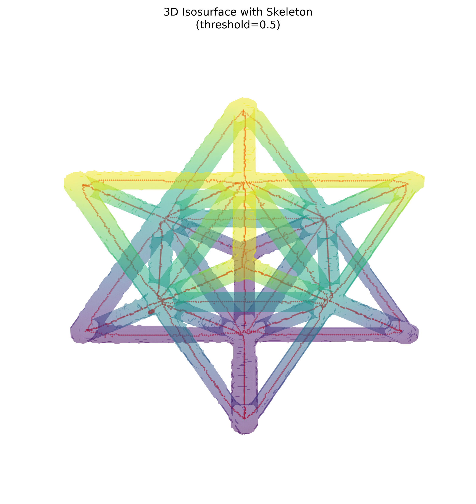
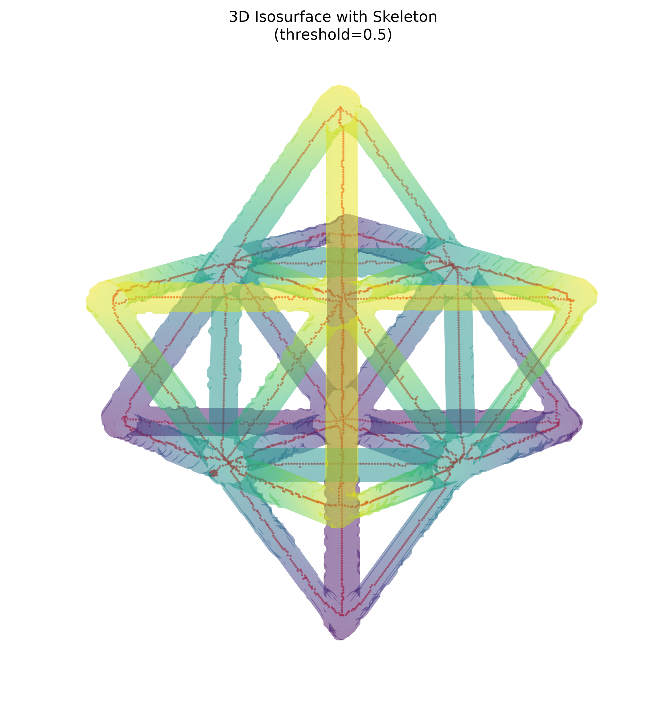

# NDE Report: Unit-Cell Volume

## Scope

This report analyzes the complete volumetric NDE file set found under `data/unitcell`:

- Original volume: `unitcell/unitcell.npy`
- Segmented mask: `unitcell/unitcell_mask.npy`
- Skeleton: `unitcell/unitcell_skeleton.npy`

All three arrays have shape `256 x 256 x 256`. The mask and skeleton are Boolean arrays. Other files under `data` (TIFF, STL, JSON, and reference images) do not form additional volume-mask-skeleton `.npy` sets and are not included in the quantitative table.

## Summary

| Category | Metric | Value |
| --- | --- | ---: |
| Volume | Shape | 256 x 256 x 256 |
| Volume | Data type | float32 |
| Volume | Minimum intensity | -0.003129 |
| Volume | Maximum intensity | 0.015258 |
| Volume | Mean intensity | 0.000539 |
| Volume | Intensity standard deviation | 0.002418 |
| Mask | Threshold verified | intensity > 0.01 |
| Mask | Foreground volume | 622,182 voxels |
| Mask | Volume fraction | 3.7085% |
| Mask ROI | Mean intensity | 0.012151 |
| Mask ROI | Intensity standard deviation | 0.000769 |
| Background | Mean intensity | 0.000092 |
| Skeleton | Skeleton voxels | 3,126 |
| Skeleton | 26-connected components | 1 |
| Skeleton | Endpoint voxels | 26 |
| Skeleton | Branch voxels | 142 |
| Skeleton | Isolated voxels | 0 |

Endpoint voxels have one occupied neighbor and branch voxels have at least three occupied neighbors in a 26-neighborhood. These voxel counts are topology proxies; physical length cannot be calculated without voxel spacing.

## 3D visual gallery

### View A - elevation 30 degrees, azimuth 45 degrees

### View B - elevation 60 degrees, azimuth 45 degrees

The translucent surface represents the segmented mask. Red points trace the skeleton. The `threshold=0.5` label in the rendered plots is the isosurface level applied to the Boolean mask, not the original intensity segmentation threshold; the verified intensity threshold is `0.01`.

## Analysis

The mask is strongly aligned with the high-intensity portion of the volume. Its mean intensity (`0.012151`) is about 132 times the background mean (`0.000092`), and direct comparison confirms that every mask voxel is exactly the result of applying `intensity > 0.01` to the source volume.

The foreground occupies only 3.71% of the full volume, consistent with a sparse lattice structure. The skeleton is fully contained within the segmented mask and forms one 26-connected component, indicating that the extracted lattice centerline is connected. The 26 endpoints and 142 branch voxels capture the terminal and junction structure, although branch-voxel counts should not be interpreted as the number of distinct junctions without clustering adjacent branch voxels.

## Validation

- Volume, mask, and skeleton shapes are compatible.
- Mask and skeleton contain only Boolean values.
- Skeleton is entirely contained within the mask.
- Mask exactly equals `unitcell.npy > 0.01`.
- No isolated skeleton voxels were found.
