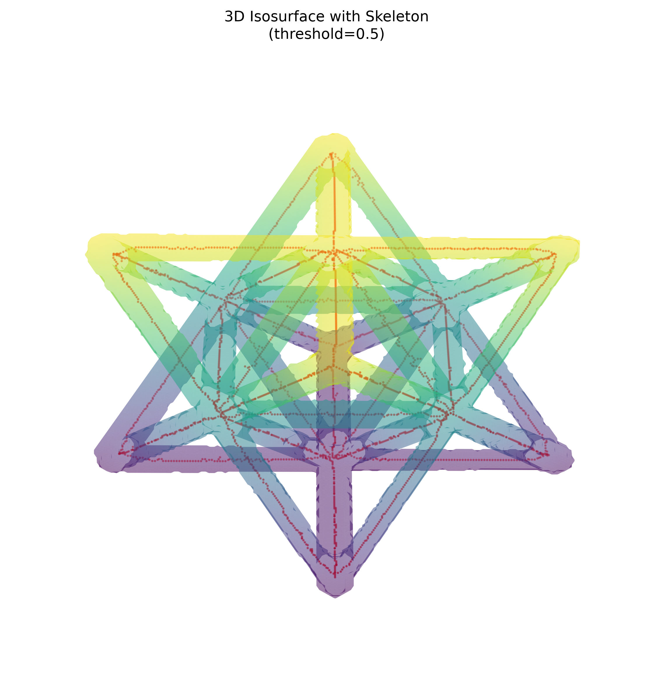
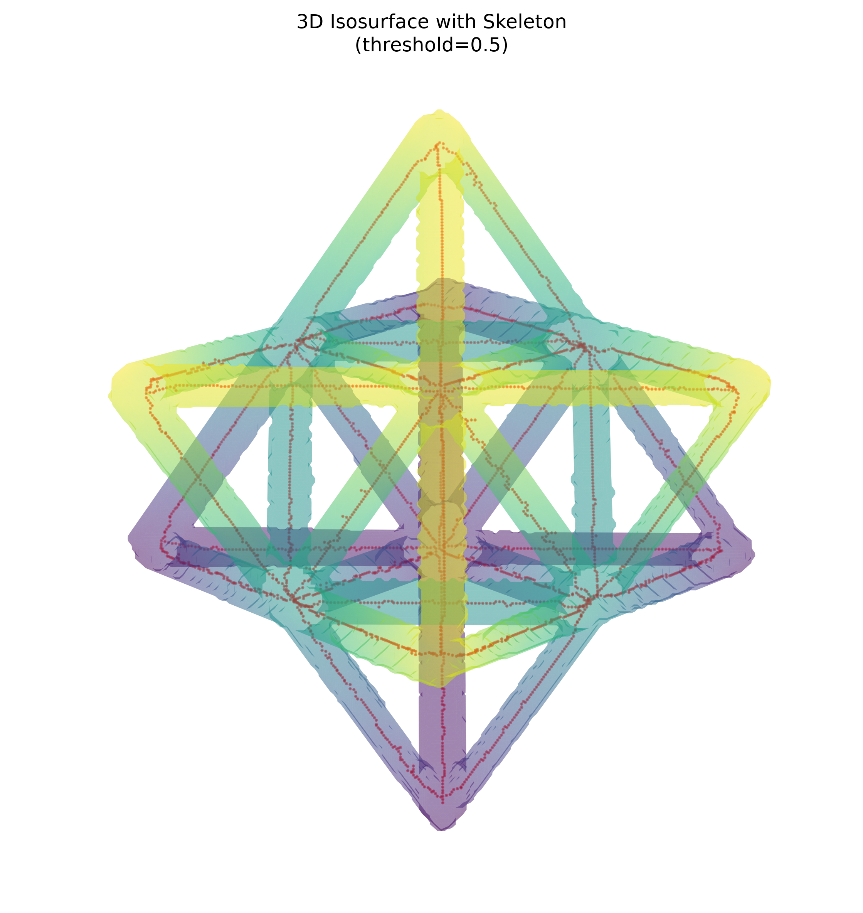

# NDE Report: Unitcell CT Segmentation

## Source Files

| Input | Path |
| --- | --- |
| Raw volume | `../unitcell/unitcell.npy` |
| Segmented mask | `../unitcell/unitcell_segmentation.npy` |
| Skeleton | `../unitcell/unitcell_skeleton.npy` |

All three arrays were shape-compatible at `(256, 256, 256)`.

## Summary Metrics

| Category | Metric | Value |
| --- | --- | ---: |
| Volume | Total voxels | 16,777,216 |
| Volume | Raw dtype | `float32` |
| Volume | Raw intensity min | -0.003129 |
| Volume | Raw intensity max | 0.015258 |
| Volume | Raw intensity mean | 0.000539 |
| Mask | Foreground voxels | 717,852 |
| Mask | Foreground fraction | 4.2787% |
| Mask | Mean intensity inside mask | 0.011696 |
| Mask | Mean intensity outside mask | 0.000040 |
| Skeleton | Skeleton voxels | 3,182 |
| Skeleton | Endpoints | 39 |
| Skeleton | Branch points | 137 |
| Skeleton | Skeletal complexity | 0.043055 |

## Visual Gallery

### View A: elevation 30.0, azimuth 45.0

### View B: elevation 60.0, azimuth 45.0

## Analysis

The segmentation aligns strongly with the raw CT intensity field. The mean raw intensity inside the mask is approximately `0.011696`, while the mean outside the mask is approximately `0.000040`, indicating that the mask isolates the high-intensity lattice material with good contrast from the background.

The mask occupies about `4.28%` of the full volume, which is consistent with a sparse lattice unit cell. The skeleton reduces the segmented material from `717,852` foreground voxels to `3,182` centerline voxels. The detected `137` branch points and `39` endpoints indicate a connected truss-like structure with several junctions and boundary terminations. The rendered skeleton follows the center of the segmented struts across both viewpoints, supporting good mask-to-skeleton alignment.
