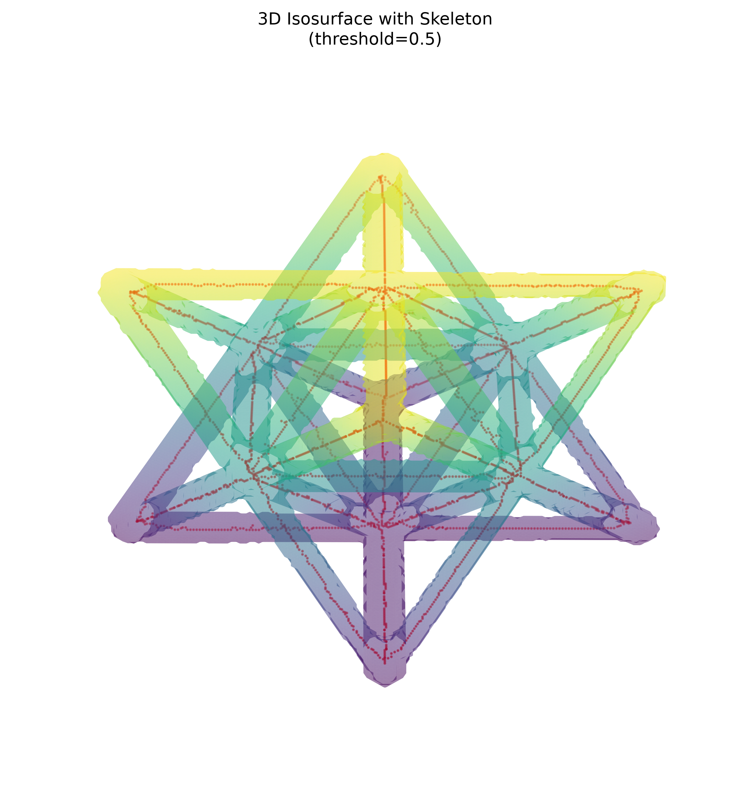

# NDE Report — Octet-Truss Unit Cell

## Scope and data integrity

This report analyzes the complete `.npy` dataset in `data/unitcell`: the reconstructed volume, two segmented masks, and their corresponding skeletons. Every array has shape `256 × 256 × 256`; therefore, all masks and skeletons are voxel-aligned with the source volume. Metrics below use the full-resolution arrays.

The volume is `float32`, ranges from `-0.00312875` to `0.01525769`, and has a global mean intensity of `0.00053907`. The masks are `uint8` and the skeletons are Boolean.

## Feature summary

| Feature | Original volume | Mask (threshold 0.01) | Skeleton (threshold 0.01) | Mask (threshold 0.5) | Skeleton (threshold 0.5) |
| --- | ---: | ---: | ---: | ---: | ---: |
| Shape | 256 × 256 × 256 | 256 × 256 × 256 | 256 × 256 × 256 | 256 × 256 × 256 | 256 × 256 × 256 |
| Mean raw intensity | 0.00053907 | 0.01215132 in ROI | 0.01237471 on centerline | 0.01170019 in ROI | 0.01239722 on centerline |
| Nonzero / occupied voxels | 12,801,024 | 622,182 | 3,126 | 717,288 | 3,177 |
| Fraction of full volume | — | 3.7085% | 0.0186% | 4.2754% | 0.0189% |
| 26-connected components | — | 1 | 1 | 1 | 1 |
| Endpoints | — | — | 26 | — | 35 |
| Branch voxels (>2 neighbors) | — | — | 142 | — | 127 |
| Skeleton voxels outside mask | — | — | 0 | — | 0 |

The `0.01` mask uses a raw-intensity cutoff. The `0.5` mask is based on min–max-normalized intensity; its equivalent raw cutoff is approximately `0.00606447`.

## Visual gallery

The gallery uses the normalized-threshold `0.5` mask with its skeleton overlaid in red. The surface was downsampled by a factor of two only for rendering.

### View A — elevation 30°, azimuth 45°

### View B — elevation 60°, azimuth 45°

## Analysis

Both masks isolate a single connected lattice structure, and both skeletons retain one connected centerline component. Every skeleton voxel is contained by its corresponding mask, demonstrating complete mask-to-skeleton alignment. The mask bounding boxes—`[37, 37, 37]` to `[218, 218, 218]` at threshold `0.01`, and `[36, 37, 37]` to `[218, 218, 218]` at threshold `0.5`—leave background on every volume boundary, so the segmented structure is not clipped.

The normalized `0.5` result contains 95,106 more mask voxels (15.3% more) than the raw `0.01` result, while their skeleton sizes differ by only 51 voxels (1.6%). This indicates that the primary lattice topology is stable, although the change from 26 to 35 endpoints and from 142 to 127 branch voxels shows some threshold sensitivity in fine centerline details. Branch counts refer to skeleton voxels with more than two occupied neighbors in a 26-neighborhood; they are not deduplicated physical junction counts.

Overall, both segmentations show strong structural consistency and valid centerline containment. The `0.5` normalized segmentation is the fuller ROI, while the `0.01` raw segmentation is the more conservative material estimate.
