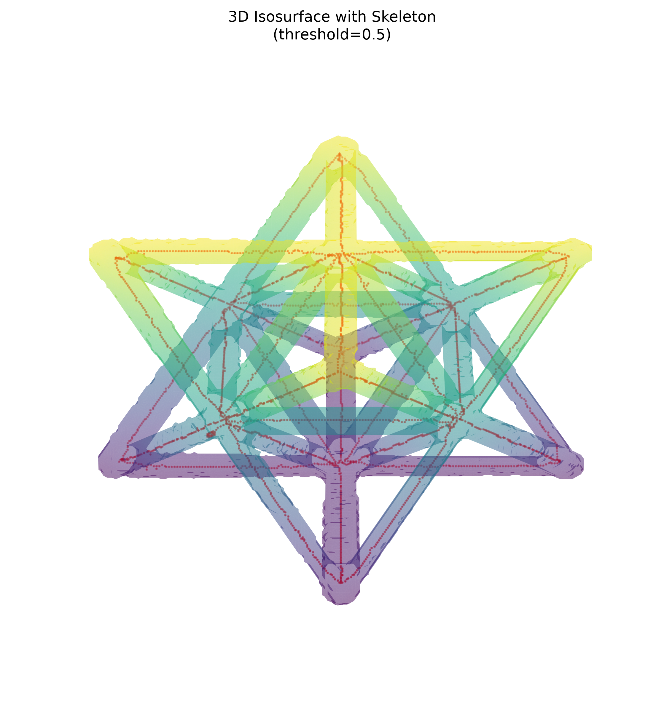
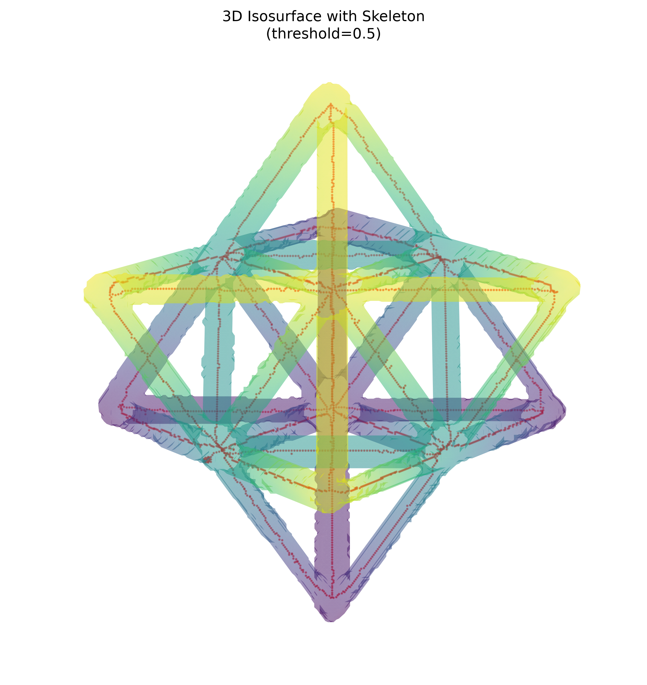

# Unit Cell Segmentation and Skeleton Report

## Processing summary

The `256 × 256 × 256` unit-cell volume was segmented at a raw intensity threshold of `0.01` (`raw >= 0.01`). The resulting binary mask was skeletonized in 3D while preserving topology. The raw volume, segmented mask, and skeleton have identical shapes.

| Feature | Original volume | Segmented mask | Skeleton |
| --- | ---: | ---: | ---: |
| Shape | 256 × 256 × 256 | 256 × 256 × 256 | 256 × 256 × 256 |
| Data type | float32 | uint8 | bool |
| Mean raw intensity | 0.00053907 | 0.01215132 within ROI | 0.01237471 at centerline voxels |
| Foreground / occupied voxels | 12,801,024 nonzero | 622,182 | 3,126 |
| Volume fraction | — | 3.7085% | 0.0186% |
| 26-connected components | — | 1 | 1 |
| Endpoints | — | — | 26 |
| Branch voxels (>2 neighbors) | — | — | 142 |
| Approximate centerline length | — | — | 4,645.16 voxel units |

## Visual gallery

### View A — elevation 30°, azimuth 45°

### View B — elevation 60°, azimuth 45°

## Analysis

The thresholded region forms one 26-connected lattice component. Its bounding box spans indices `[37, 37, 37]` through `[218, 218, 218]`, so the detected structure remains separated from the volume boundary. The ROI mean intensity (`0.01215132`) is substantially higher than the background mean (`0.00009184`), consistent with material/background separation at the requested cutoff.

The skeleton is also a single connected component, and all 3,126 skeleton voxels lie inside the segmented mask. This demonstrates complete mask-to-centerline containment and preservation of the lattice's global connectivity. The 26 endpoints and 142 branch voxels quantify centerline topology; branch voxels are voxels with more than two occupied neighbors in a 26-neighborhood, not deduplicated physical junctions.

The surfaces in the visualizations were downsampled by a factor of two for rendering. All reported mask and skeleton metrics were calculated from the full-resolution arrays.
