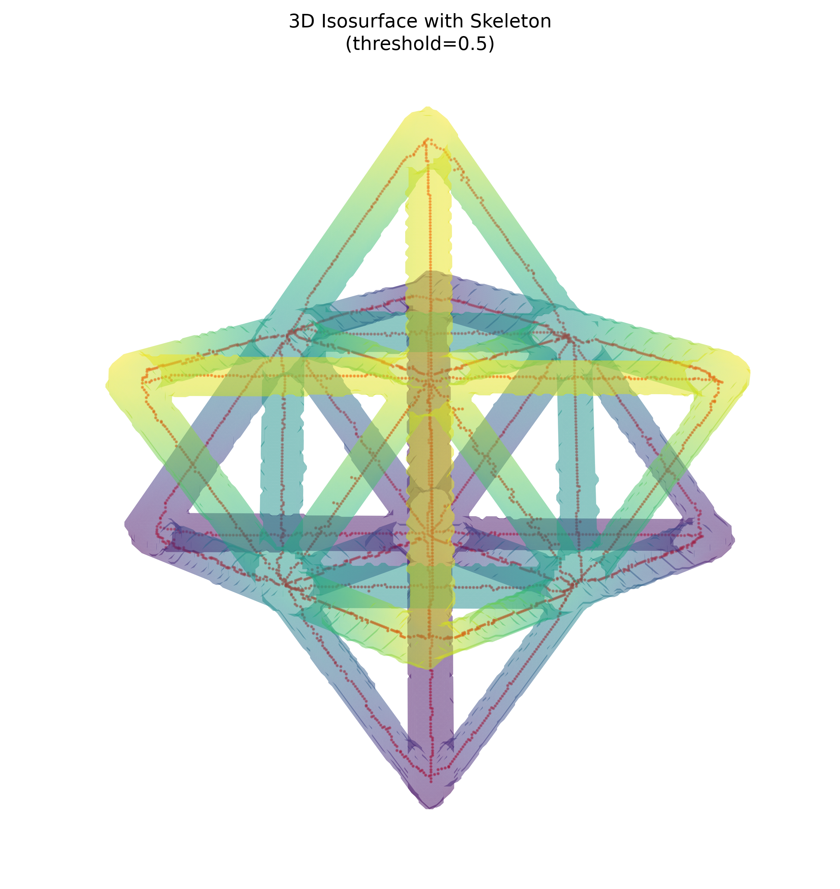

# Unit Cell Segmentation and Skeleton Report

## Processing summary

The `256 × 256 × 256` unit-cell volume was min–max normalized and segmented at a normalized threshold of `0.5`. The resulting binary mask was skeletonized in 3D while preserving topology. All three arrays have identical shapes.

> The raw intensity range is `-0.00312875` to `0.01525769`, so `0.5` is interpreted in normalized intensity space. In raw units, the cutoff is approximately `0.00606447`.

| Feature | Original volume | Segmented mask | Skeleton |
| --- | ---: | ---: | ---: |
| Shape | 256 × 256 × 256 | 256 × 256 × 256 | 256 × 256 × 256 |
| Data type | float32 | uint8 | bool |
| Mean raw intensity | 0.00053907 | 0.01170019 within ROI | 0.01239722 at centerline voxels |
| Foreground / occupied voxels | 12,801,024 nonzero | 717,288 | 3,177 |
| Volume fraction | — | 4.2754% | 0.0189% |
| 26-connected components | — | 1 | 1 |
| Endpoints | — | — | 35 |
| Branch voxels (>2 neighbors) | — | — | 127 |
| Approximate centerline length | — | — | 4,601.24 voxel units |

## Visual gallery

### View A — elevation 30°, azimuth 45°

### View B — elevation 60°, azimuth 45°

## Analysis

The thresholded region forms one 26-connected lattice component. Its bounding box spans indices `[36, 37, 37]` through `[218, 218, 218]`, leaving background around the structure rather than clipping it at the volume boundary. The ROI mean intensity (`0.01170019`) is substantially higher than the background mean (`0.00004058`), consistent with effective material/background separation.

The skeleton is also a single connected component, and all 3,177 skeleton voxels lie inside the segmented mask. This indicates complete mask-to-centerline containment and preservation of the lattice's global connectivity. The 35 endpoints and 127 branch voxels quantify the centerline topology; branch voxels are reported as voxels with more than two occupied neighbors in a 26-neighborhood and should not be interpreted as deduplicated physical junctions.

The surface shown in each visualization is downsampled by a factor of two for rendering, while the reported mask and skeleton metrics are calculated from the full-resolution arrays.
