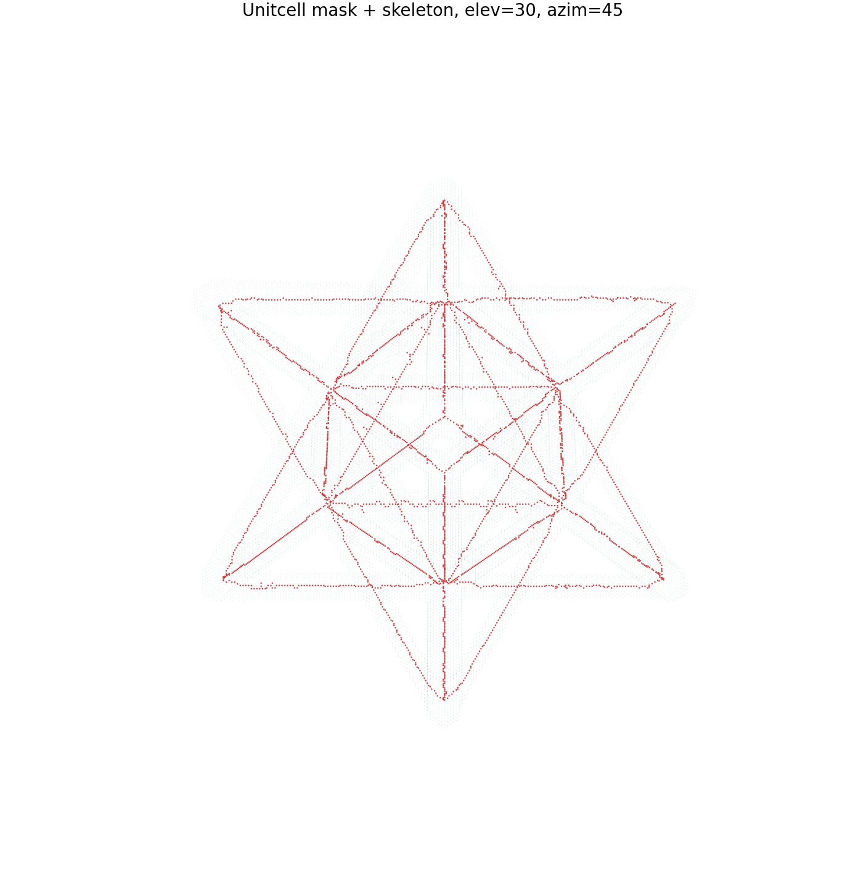
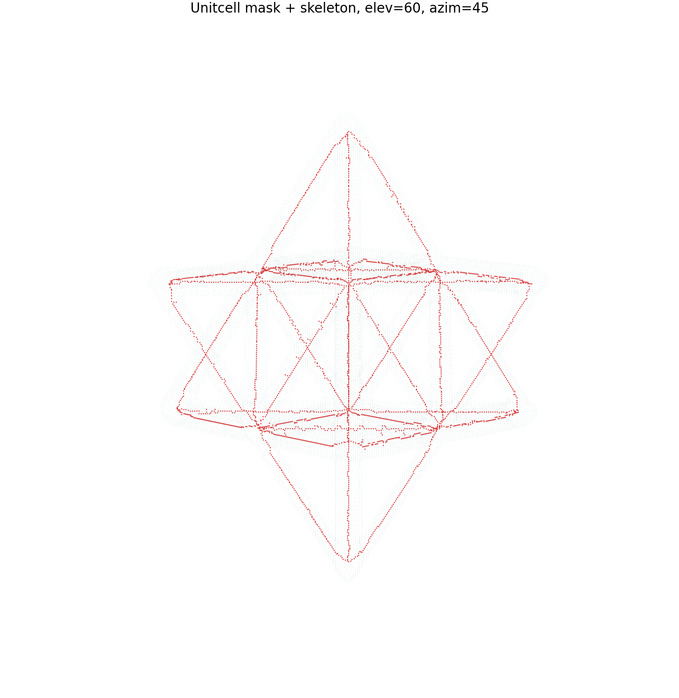

# Non-Destructive Evaluation Report: Unit Cell CT Volume

Generated: 2026-07-20

## Inputs

| Role | File | Notes |
| --- | --- | --- |
| Raw CT volume | `data/unitcell/unitcell.npy` | Float32 intensity volume, shape `256 x 256 x 256` |
| Segmented mask | `data/unitcell/unitcell_segmented_otsu.npz` | Otsu-thresholded binary mask, threshold `0.005864716` |
| Skeleton | `data/unitcell/unitcell_skeleton.npz` | 3D skeleton derived from the segmented mask |

Other files in `./data` include lattice geometry, TIFF stacks, STL files, and reference images, but `data/unitcell` is the complete raw-volume/mask/skeleton set available for this NDE report.

## Summary Metrics

| Measurement | Value |
| --- | ---: |
| Volume shape | `256 x 256 x 256` |
| Total voxels | 16,777,216 |
| Mean intensity, full volume | 0.000539 |
| Mean intensity, masked ROI | 0.011697 |
| ROI intensity standard deviation | 0.001408 |
| ROI intensity range | 0.005865 to 0.015258 |
| Mask foreground voxels | 717,733 |
| Mask foreground fraction | 4.2780% |
| Skeleton voxels | 3,184 |
| Skeleton-to-mask voxel fraction | 0.4436% |
| Skeleton endpoints | 40 |
| Skeleton branch points | 22 |
| Skeleton contained inside mask | Yes |

## Visual Gallery

### View A: Elevation 30, Azimuth 45

### View B: Elevation 60, Azimuth 45

## Analysis

The segmentation isolates a compact high-intensity structure from the raw CT volume: the masked ROI has a mean intensity about 21.7 times higher than the full-volume mean. The foreground occupies 4.2780% of the volume, which is consistent with a sparse lattice-like specimen rather than a solid block.

The skeleton is fully contained inside the segmented mask, indicating good mask-to-skeleton alignment. Its 3,184 voxels reduce the segmented structure by 99.56% while preserving a connected morphological trace. The 40 endpoints and 22 branch points suggest a moderately branched lattice topology with multiple terminal features visible in the segmented unit cell.

The two 3D views show the same mask surface with the skeleton overlaid in red. From both perspectives, the skeleton follows the interior of the segmented regions without obvious displacement outside the ROI, supporting the interpretation that the segmentation and skeletonization are mutually consistent.
